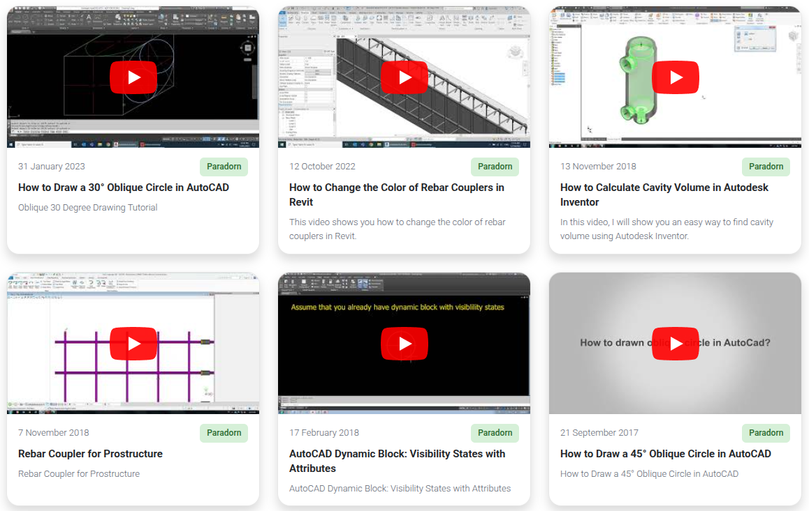

# Webinar Cards

A WordPress plugin that replaces hardcoded webinar listings with dynamic webinar posts managed from the admin area. Each card displays a video thumbnail that plays inline on click — no page redirect. Supports both YouTube and Vimeo.

**Version:** 1.1.0 | **Requires:** WordPress 6.0+, PHP 7.4+ | **License:** GPLv2



---

## Installation

1. Upload the `webinar-cards` folder to `/wp-content/plugins/`.
2. Activate the plugin through **WordPress Admin → Plugins**.
3. Add webinars under the new **Webinars** menu.
4. Fill in the YouTube or Vimeo URL, Speaker, and Date in the **Webinar Details** meta box.
5. Add a short description using the **Excerpt** field (enable via Screen Options if hidden).
6. Place `[webinar_cards]` in any page, post, or Elementor shortcode widget.

---

## Shortcode

```
[webinar_cards]
```

### Attributes

| Attribute | Default | Description |
|-----------|---------|-------------|
| `columns` | `3` | Desktop columns (1–6) |
| `tablet_columns` | `2` | Tablet columns (1–4) |
| `mobile_columns` | `1` | Mobile columns (1–2) |
| `posts_per_page` | `12` | Maximum number of cards to show |
| `category` | _(all)_ | Filter by Webinar Category slug(s), comma-separated |

### Examples

```
[webinar_cards]
[webinar_cards columns="4" tablet_columns="2" mobile_columns="1"]
[webinar_cards posts_per_page="6"]
[webinar_cards category="marketing"]
[webinar_cards category="marketing,sales" columns="2"]
```

---

## Features

| Feature | Description |
|---------|-------------|
| Custom post type | Manage webinars from the WordPress admin |
| Meta fields | YouTube/Vimeo URL, Speaker, Date |
| Excerpt | Short description shown on the card |
| Categories | Webinar Categories taxonomy with slug-based shortcode filtering |
| Responsive grid | Desktop / tablet / mobile column control via shortcode |
| YouTube thumbnails | Pulled automatically — no API key required |
| Vimeo thumbnails | Fetched via oEmbed API, cached 30 days per video |
| Inline playback | Video plays inside the card on click (fullscreen available) |
| Output caching | 1-hour transient cache, auto-invalidated on content change |
| Auto-updater | Self-hosted — no wordpress.org required (SHA-256 verified) |

---

## Email Gate

Restrict video access to specific email domains or addresses via **Webinars → Access Settings**.

| Behaviour | Detail |
|-----------|--------|
| Gate trigger | Guests who click a video are prompted for their email |
| Allow by domain | e.g. `company.com` — any address at that domain is granted access |
| Allow by address | Specific email addresses can be individually whitelisted |
| Access token | Secure 24-hour httponly cookie |
| Cache compatibility | JS-readable `wbc_granted` cookie ensures the gate works with NitroPack, LiteSpeed Cache, WP Rocket, etc. |
| Logged-in users | Always bypass the gate automatically |

---

## FAQ

**Why doesn't a webinar appear in the grid?**
Webinars are ordered by the Date field. Webinars without a date are still shown but sorted to the bottom.

**The YouTube thumbnail has black bars — how do I fix it?**
The plugin uses `mqdefault.jpg` (always 16:9). If bars appear, check that the YouTube URL is correct and the video is publicly accessible.

**Can I show all webinars with no limit?**
Set `posts_per_page` to a large number such as `100`.

**Where do I find the category slug?**
Go to **Webinars → Categories**. The slug is shown in the Slug column.

---

## Files

```
webinar-cards/
├── webinar-cards.php                      # Plugin entry point
├── uninstall.php                          # Cleanup on uninstall
├── includes/
│   ├── class-webinar-cards.php            # Core singleton
│   ├── class-webinar-cards-cpt.php        # Custom post type & taxonomy
│   ├── class-webinar-cards-meta.php       # Meta boxes (URL, speaker, date)
│   ├── class-webinar-cards-shortcode.php  # Shortcode rendering & cache
│   ├── class-webinar-cards-access.php     # Email gate logic
│   ├── class-webinar-cards-settings.php   # Access Settings admin page
│   ├── class-webinar-cards-helpers.php    # Shared utilities
│   ├── class-webinar-cards-help.php       # Shortcode Guide admin page
│   └── class-webinar-cards-updater.php    # Auto-updater
└── assets/                                # CSS and JS
```

---

## Changelog

### 1.1.1
- Fix: Registration link now redirects the user back to the originating page after account creation.

### 1.1.0
- New: Email gate — restrict video access by allowed domain or specific email address.
- New: Access Settings page (Webinars → Access Settings) to manage gate rules.
- New: Secure 24-hour access token (httponly cookie) + JS-readable grant cookie for page-cache compatibility.
- New: Gate modal with email input, inline error messages, and sign-in / register fallback links.
- Fix: Webinars without a Date field were excluded after cache expiry (meta_key inner-join bug) — all published webinars now appear, undated ones sort to the bottom.

### 1.0.0
- Initial release: custom post type, Webinar Categories taxonomy, responsive grid shortcode.
- YouTube and Vimeo inline embed on card click (autoplay, fullscreen-capable).
- YouTube `mqdefault` thumbnail (16:9, no black bars); Vimeo thumbnail via oEmbed, cached 30 days.
- Shortcode output caching via transient (1 hour, auto-invalidated).
- N+1 query prevention via `update_meta_cache()`.
- Self-hosted auto-updater with optional SHA-256 checksum verification.
